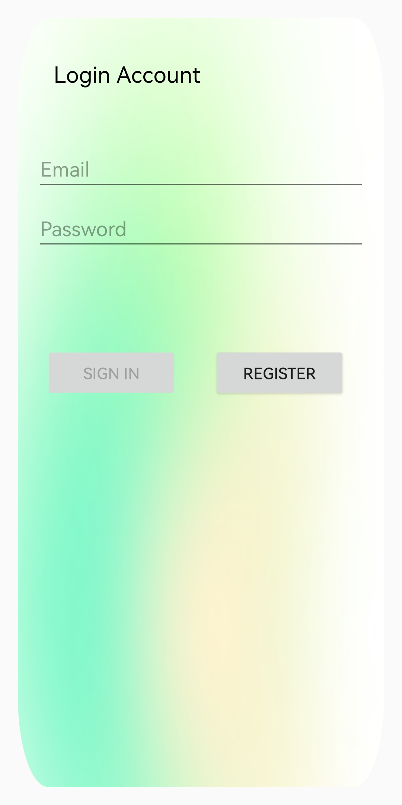
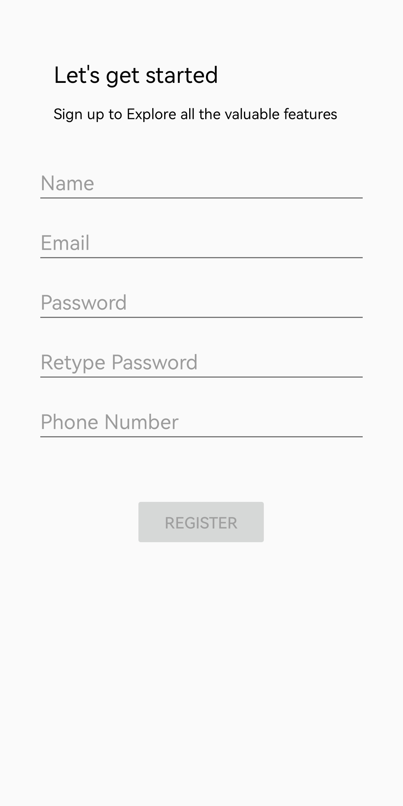
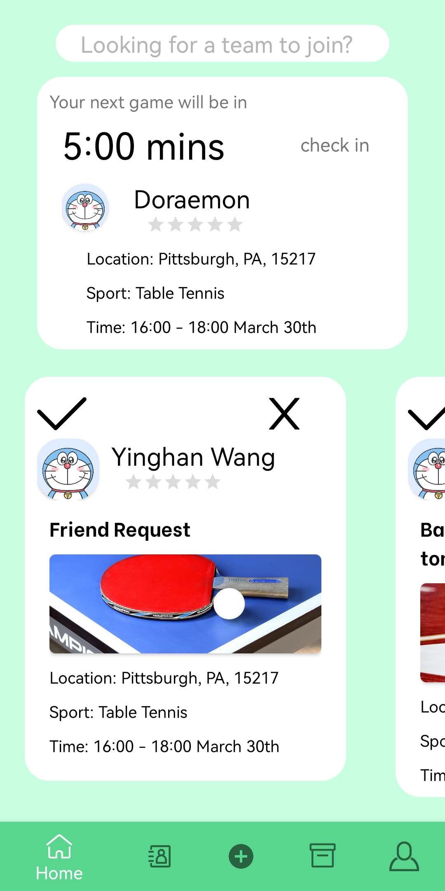
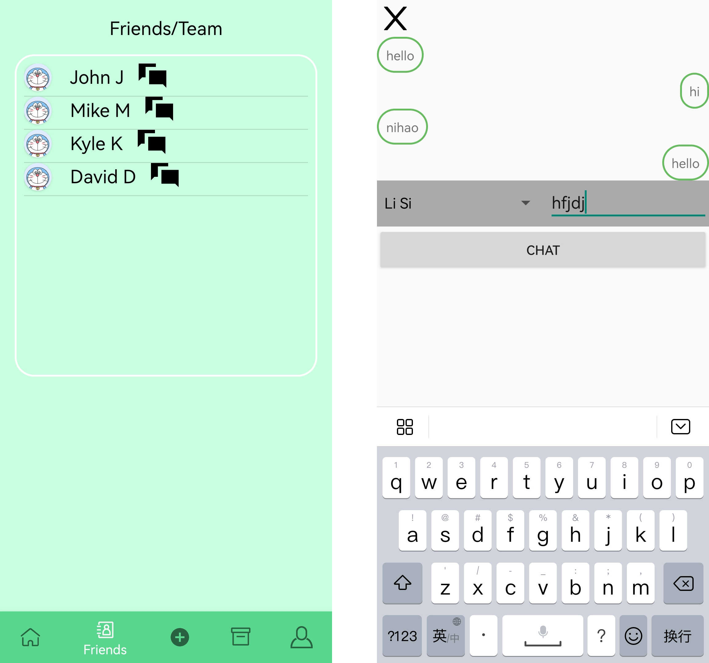
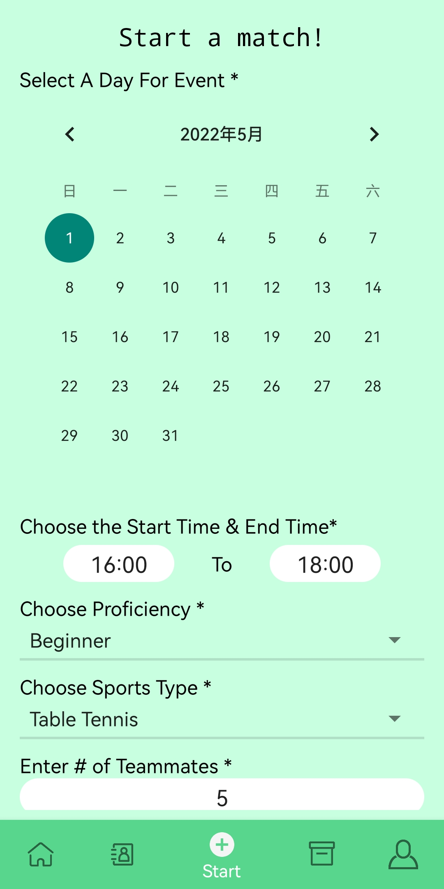
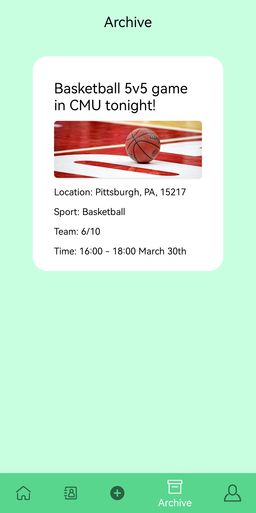
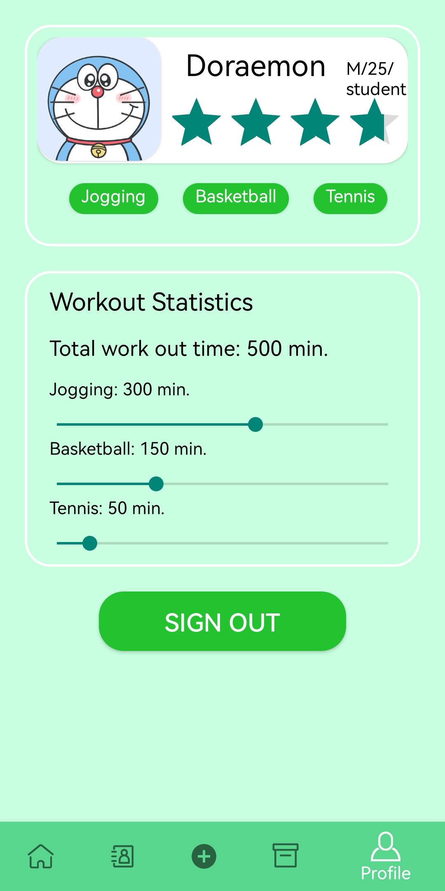

# SportsB

## 1. Overview

SportsB is an application designed to help sports players to find suitable sport mates online!

People in modern society live a fast-paced life. And an important principle of app design is to show the value as soon as possible. SportsB is committed to providing users with an efficient environment to find their sports mates.

There are many popular sports that require multiple players to start or have more fun. For example, it’s unlikely people play team sports like basketball or soccer on their own, it would be incredibly boring.

Besides, regarding the other popular sports that could be done by one person like jogging and hiking; people could have more fun and ensure safety if they go with partners. It creates a chance for people to chat and make friends. Also, when some accidents happen, there would be someone to help!

Obviously, having a suitable sports mate greatly influences the experience of exercising. In addition to having the same sport of interest, the proficiency, the attitude, and even the personality of teammates/sport mates matters. For instance, if you are a beginner, you may want to find a person who is also a rookie so that you both can make progress together.

As a result, SportsB provides users with not only a variety of sports and an efficient matching system, but also detailed information about the players to make it more possible for users to find suitable sport mates and matches.

In addition, we value users’ security, so we are going to provide features that ensure users’ life security and information security as well.

## 2. Functionalities

There are two main activities in our application, which are `LoginActivity` and `MainActivity`. The `LoginActivity` handles users' login and register interactions. The `MainActivity` handles core functions of this application.

### 2.1 Login and Register

The login page takes user's email and password as input. When the format and length of email and password is checked, and the login button is pressed, user's info will be passed to the backend service to validate.


Users must enter their name, email, password and phone number in order to create an account. This page will also checks user's information.


### 2.2 Home

There are three main fragments on the home page, which are search bar, next match event prompt and match invitation or friend request list. Users are able to search relevant match information or friend requests in the search bar. The next match prompt reminds users to check for the next match. Users can easily interact with match invitation or friend request list by pressing the accept or dismiss button on a single item.


### 2.3 Friends

On the friends page, users can see their friends and match groups. By pressing into the chat button, they are able to chat with them easily.



### 2.4 Start Match

Users can create a new match on the start match page. They are supposed to enter the date of the match, proficiency level of the match, sport type of the match as well as number of members in the match.


### 2.5 Archive

If users pressed the accept button of match invitation on the home page, those matches will be added to the archive page. So users can view and check the matches they are supposed to join.


### 2.6 Profile

On the profile page, users can view their basic information and sports status. For example, they can view how much time they devoted on a single sport.


## 3. Project Structure

Here's the overall architecture of our project. 

```
app/
├─ src/
│  ├─ main/
│  │  ├─ java/
│  │  │  ├─ edu/cmu/sportsmatching/
│  │  │  │  ├─ data/
│  │  │  │  ├─ ui/
│  │  │  │  │  ├─ archive/
│  │  │  │  │  ├─ home/
│  │  │  │  │  ├─ profile/
│  │  │  │  │  ├─ signup/
│  │  │  │  │  ├─ startmatch/
│  │  │  │  │  ├─ login/
│  │  │  │  ├─ LoginActivity.kt
│  │  │  │  ├─ MainActivity.kt
│  │  ├─ res/
```

## 3. Requirements
- Android 9
